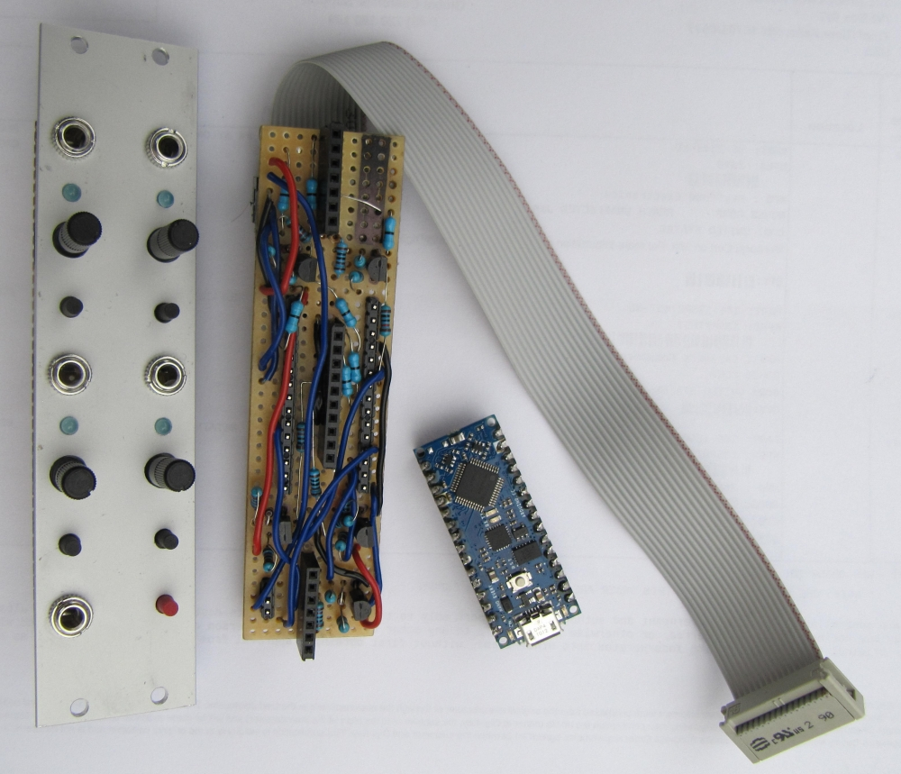
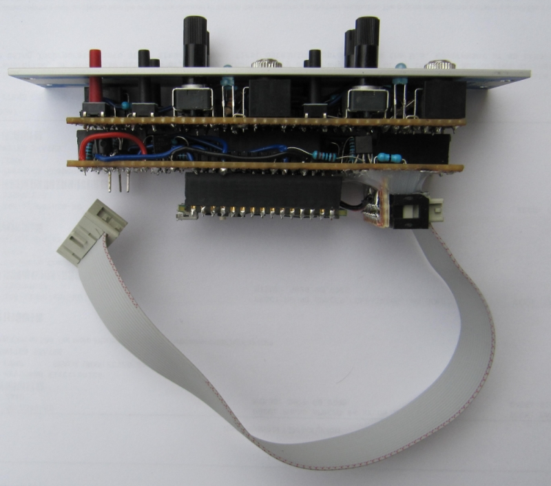
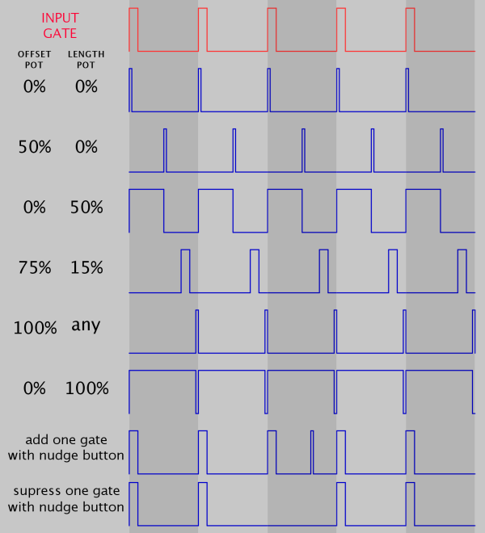
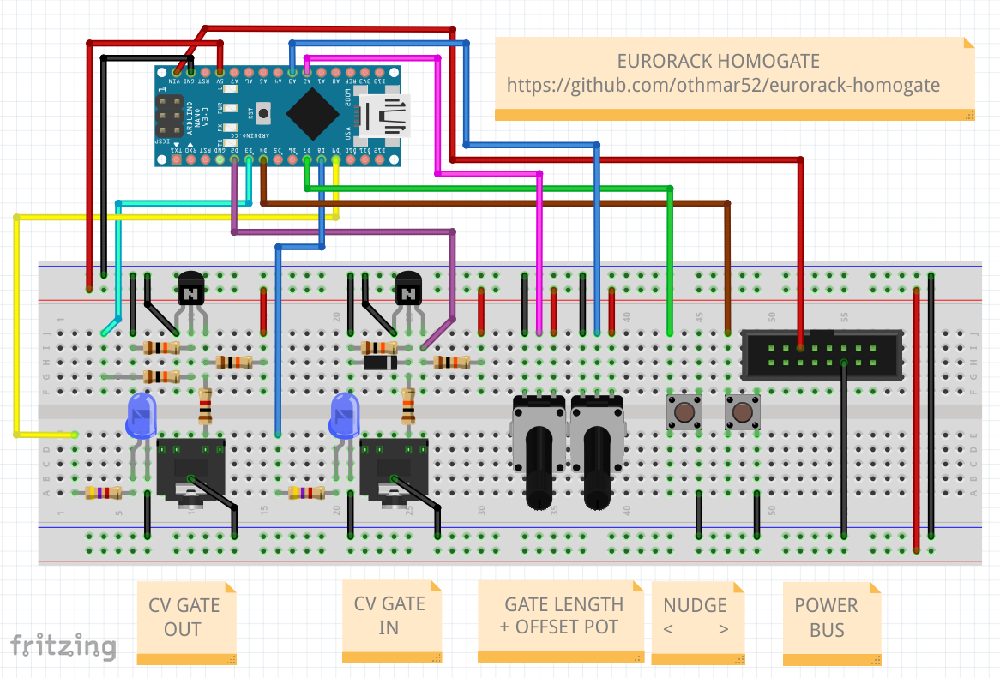
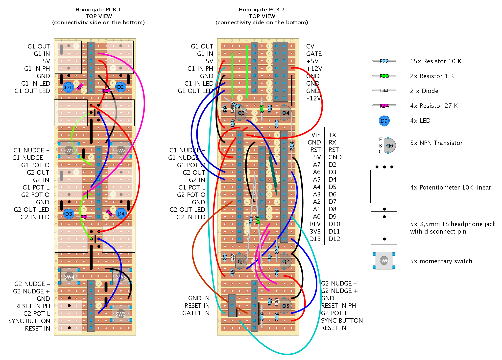

# eurorack homogate

arduino based eurorack module to  
 - increase or decrease length of incoming gate
 - apply time offset to a gate
 - add or remove single gate pulses

  
  

this module needs a steady (homogeneously) incoming gate/clock preferably from a clock divider.  
the "unit" homogate is dealing with is always the time interval of the incoming gate.  

the potentiometers for length and offset are 0% to 100% where 100% is the incoming interval  
In case the sum of both potentiometers exceeds 100% the offset pot gets priority and the length gets the maximum remaining time of the interval  

there are 2 instances of homogate in one 6HP module whilst the gate input from instance 1 is normalized to input instance 2  

very useful in combination with the TuringMachine (https://github.com/TomWhitwell/TuringMachine)  
this module gives us the possibility to nudge a locked sequence left and right on the "timeline" by adding or supressing single gate pulses  

  

## parts
 - Arduino Nano Every
 - 5 x 3.5mm TRS female jacks (CV clock in/out)
 - 5 x NPN Transistor N3904 (CV in/out circuit)
 - 15 x Resistor 10K (CV in/out circuit)
 - 2 x Resistor 1K (CV out circuit)
 - 3 x Diode 1N4148 (CV in circuit)
 - 4 x LED blue (in/out gate indicator)
 - 4 x Resistor 4.7K (for 2 LEDs)
 - 4 x Trimpot 10K (for gate length & offset)
 - 5 x Pushbuttons (for nudging & one future feature)
 - 1 x Box Header 10 pin or 16 pin (for connection to power BUS)
## circuit on the breadboard for one instance
  

## diy PCB schematics
  

